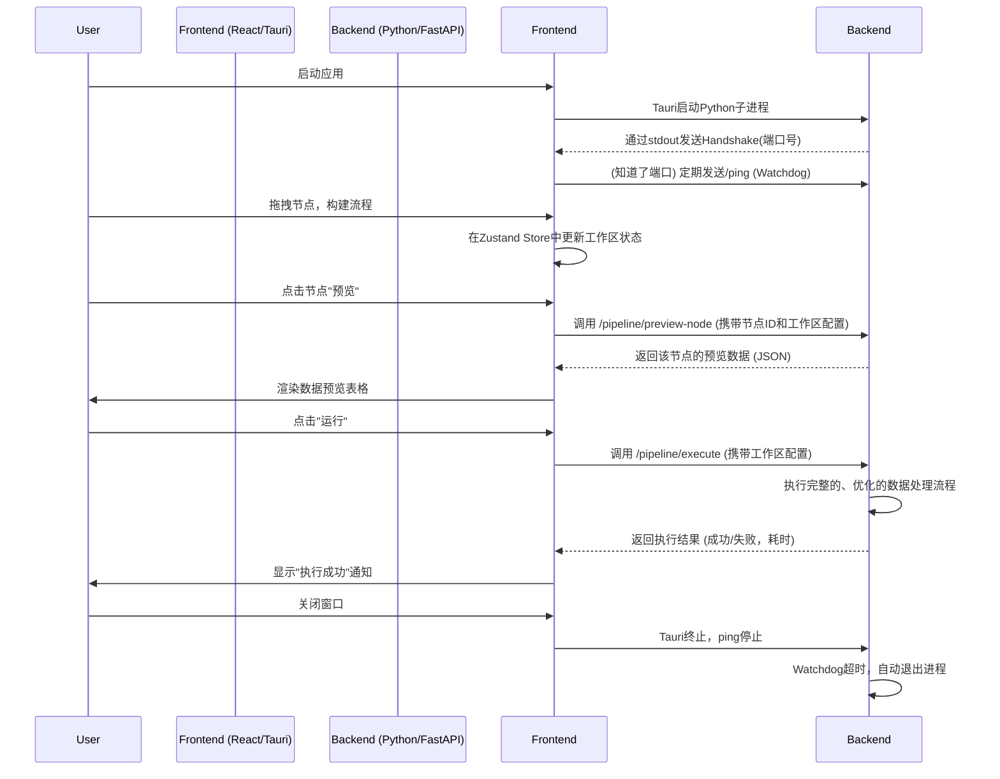

# FlowExcel 项目架构深度分析

本文档对 `FlowExcel` 项目进行深入的技术架构和功能分析，涵盖前端、后端及桌面容器的各个模块。

## 1. 宏观架构

`FlowExcel` 采用了一种现代的混合桌面应用架构，旨在将 Web 技术的开发效率与 Python 数据科学生态的强大功能相结合。

-   **前端 (UI & 交互)**: 使用 **React** (通过 **Vite** 构建) 编写，负责提供用户界面，特别是核心的 **ReactFlow** 可视化流程编辑器。
-   **后端 (数据处理引擎)**: 一个基于 **FastAPI** 的高性能 Python 服务，利用 **Pandas** 作为核心数据处理库。
-   **桌面容器 (打包 & 集成)**: **Tauri** 框架将前端和后端打包成一个跨平台的单一可执行文件，并负责管理后端进程的整个生命周期。

### 1.1. 核心交互流程

---

## 2. 前端架构 (`src/`)

前端架构职责清晰，将 UI 渲染、状态管理和业务逻辑有效分离。

### 2.1. 组件结构 (`src/components`)

-   **`flow/` (核心流程)**
    -   **`FlowEditor.tsx`**: 流程编辑器的**协调器**。它处理 React Flow 的事件（如节点拖动、连接），并调用 Zustand 的 actions 来同步状态。它还负责触发自动布局、执行流程和工作区导出等顶层操作。
    -   **`nodes/`**: 存放所有自定义 React Flow 节点的组件。
        -   **`NodeFactory.ts`**: 一个节点类型到其对应 React 组件的**映射**，实现了节点类型的动态渲染。
        -   **`EnhancedBaseNode.tsx`**: 可能是一个高阶组件或基础节点，封装了所有节点的通用功能（如标题、端口、错误状态）。
        -   **具体节点 (`IndexSourceNode.tsx`, `RowFilterNode.tsx`, etc.)**: 每个文件代表一种特定类型的节点 UI 和交互逻辑。
-   **`workspace/` (工作区管理)**
    -   `FileLibrary.tsx`: 管理用户上传的 Excel 文件列表。
    -   `WorkspaceToolbar.tsx`: 应用顶部的工具栏，包含运行、保存等全局操作。
-   **`ui/` (通用UI)**: 封装了来自 Radix UI 的基础组件，提供了全局统一的 `Button`, `Card`, `Select` 等。

### 2.2. 状态管理 (`src/stores`)

-   **`useWorkspaceStore.ts` (Zustand)**: 这是应用的**单一事实来源 (Single Source of Truth)**。它存储了当前工作区的几乎所有持久化状态，包括文件列表、节点配置 (`flow_nodes`) 和连接配置 (`flow_edges`)。组件通过调用此 store 中定义的 actions 来修改状态，确保了状态变更的可预测性。
-   **React Flow 内部状态**: `FlowEditor` 使用 `useNodesState` 和 `useEdgesState` 来管理节点的 UI 状态（如位置、选中状态）。这种状态是临时的，并与 `useWorkspaceStore` 双向同步，实现了业务状态和 UI 状态的分离。

### 2.3. 数据获取与逻辑 (`src/hooks`, `src/lib`)

-   **`hooks/workspaceQueries.tsx` (TanStack Query)**: 集中管理所有与后端交互的异步操作。它为"执行流程"、"预览节点"等 API 调用定义了 `useMutation`，优雅地处理了加载状态、错误和缓存。
-   **`lib/flowValidation.ts`**: 封装了流程图的**业务规则验证逻辑**。例如，`isValidConnection` 函数定义了哪些节点之间可以连接，`validateFlow` 则检查整个流程是否满足执行条件（如必须有输出节点）。
-   **`lib/flowLayout.ts`**: 封装了使用 `dagre` 库进行自动布局的算法，使 `FlowEditor` 的代码更简洁。
-   **`lib/apiClient.ts`**: 一个基于 `axios` 的 API客户端，封装了所有对后端 FastAPI 服务的 HTTP 请求。

---

## 3. 后端架构 (`src-python/`)

后端是一个设计精良、高度优化的数据处理引擎，其分层结构确保了可维护性和性能。

### 3.1. API 与服务层 (`src/app/`)

-   **`main.py`**: FastAPI 应用的入口。它负责启动 Uvicorn 服务器，设置中间件（CORS, i18n），并包含与 Tauri 通信的**握手(handshake)和看门狗(watchdog)**机制。
-   **`routers/*.py`**: API 路由层。
    -   **`pipeline_router.py`**: 定义了 `/execute` 和 `/preview-node` 端点。它本身不包含复杂逻辑，而是将请求**委托**给 `PipelineService`。它使用 `@i18n_error_handler` 装饰器来集中处理异常并返回国际化的错误信息。
-   **`services/pipeline_service.py`**: **协调与门面 (Facade) 层**。
    -   **职责**:
        1.  作为 API 路由的直接处理者。
        2.  **管理节点预览逻辑**: `preview_node` 方法是预览功能的总入口。它通过**递归调用 `_get_upstream_dataframe_outputs`** 来获取上游节点的输出，并利用 `GlobalContext` 作为**内存缓存 (Memoization)**，避免在单次预览中重复计算。
        3.  **分发执行任务**: `execute_pipeline_from_request` 方法将生产环境的执行请求直接转发给 `PipelineExecutor`。
    -   **设计模式**: 它通过一个处理器注册表 (`self.processors`) 实现了**策略模式 (Strategy Pattern)**，可以根据节点类型动态选择处理器。

### 3.2. 核心执行引擎 (`src/pipeline/`)

这是整个项目的技术核心，负责高效、正确地执行数据流程。

-   **`execution/executor.py` (PipelineExecutor)**: **指挥官**。
    -   **核心算法**:
        1.  **反向路径分析 (`PathAnalyzer`)**: 在执行前，它会从目标节点（Output）**反向遍历**图，将整个流程分解为多个独立的**执行分支 (`ExecutionBranch`)**。
        2.  **批量预加载 (`BatchPreloader`)**: 根据分析结果，一次性将所有需要用到的 Excel 工作表加载到内存中，避免了零散的文件 I/O。
        3.  **索引驱动的分支执行**: 它遍历每个分支，首先运行分支的 `IndexSource` 节点获取索引值列表。然后，它**为每个索引值独立地执行一次该分支的后续节点**。这有效地处理了多对多的查找和聚合关系，避免了`CROSS JOIN`（笛卡尔积）带来的性能灾难。
-   **`processors/*.py`**: **原子操作层 (策略实现)**。
    -   每个处理器 (如 `RowFilterProcessor`, `AggregatorProcessor`) 都继承自 `AbstractNodeProcessor`，并实现了一个 `process` 方法。
    -   **职责**: 每个处理器只负责一种数据操作。它接收一个 DataFrame 作为输入，根据节点配置进行处理，然后返回一个新的 DataFrame。
    -   **健壮性**: 处理器内部包含了大量的**安全类型转换**和**错误处理**逻辑，以应对 Excel 数据中常见的类型不一致问题，确保了单个节点的失败不会导致整个流程崩溃。
-   **`models.py`**: 定义了整个执行引擎中使用的数据结构，如各种 `*Input`, `*Output` 模型，以及 `GlobalContext`, `PathContext` 等，确保了各模块间数据传递的类型安全和一致性。

## 4. 总结：关键设计决策

-   **前后端分离**: 即使在桌面应用中，依然保持了清晰的前后端分离架构，使得两端可以独立开发和测试。
-   **声明式 UI 与集中式状态管理**: 前端采用现代 React 范式，UI 是状态的映射，状态变更是可预测的，降低了复杂性。
-   **分层的后端服务**: 后端通过 API层 -> 服务层 -> 执行引擎层 -> 处理器层 的精细分层，将职责清晰地划分开，提高了代码的可维护性和可扩展性。
-   **性能优先的执行策略**: 后端执行引擎没有采用简单的线性执行，而是通过路径分析、批量预加载和分支执行等高级策略，从根本上解决了数据处理中的常见性能瓶颈。
-   **健壮的进程管理**: Tauri 的 Sidecar 模式，结合后端的 Handshake 和 Watchdog 机制，确保了后端进程与主应用的生命周期同步，提供了稳定可靠的用户体验。 